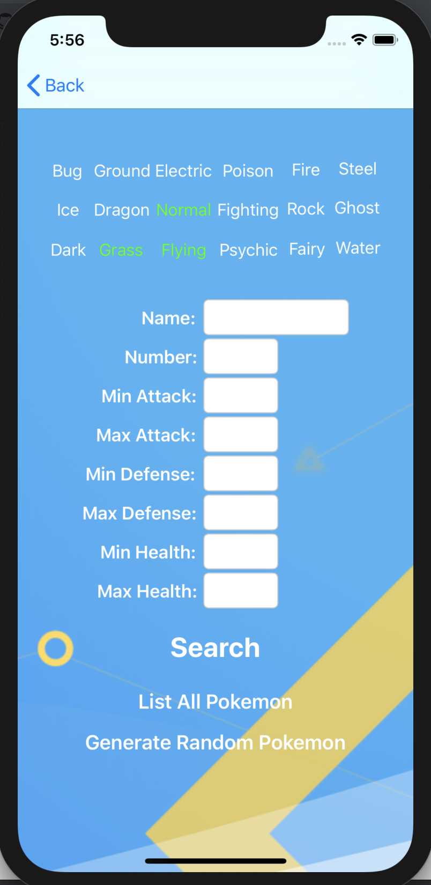

# Pokedex
Pokedex is our second mini project for our training program for Mobile Developers of Berkeley. This application features a functioning Pokedex that presents Pokemon in tables, including all their stats in presentable formats through raw JSON data. Users can obtain info about any Pokemon through a search functionality. They can also add Pokemon to their "Favorite Pokemon List", which is presented in a Tab Bar Controller. Compatible with iPhone X and later**

<h1>Screenshots of the Game</h1>

<h3>Main Menu Table View:</h3>

<h3>Main Menu Collection View:</h3>

<h3>Pokemon Profile Display that shows relevant statistics:</h3>

<h3>Advanced Search Screen for filters relevant statistics</h3>

<h3>Search Screen that automatically updates Table / Collection View with user input:</h3>

